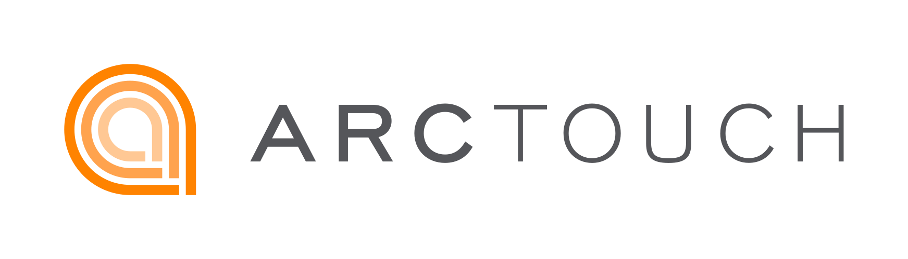

# App Intents Blueprint Deck — HTML Build Specs

Handoff document for continuing work on the ArcTouch-branded HTML presentation. No build step: edit `index.html`, `styles.css`, and `assets/`, then reload in a browser.

## Repository layout

| Path | Role |
|------|------|
| `index.html` | All slide markup (17 slides inside `#track`) |
| `styles.css` | ArcTouch tokens, layout, slide components |
| `deck.js` | Horizontal carousel navigation, deep links, Swift highlighting |
| `assets/` | Logos, illustrations, screenshots |
| `vendor/` | highlight.js + Swift grammar, Phosphor icon font |
| `tools/` | PDF export (`export-pdf.mjs`, `merge-pdf.py`) |
| `README.md` | Quick start |
| `DECK-SPECS.md` | This file |

**Original source:** `App_Intents_Blueprint.pptx` (NotebookLM-style outline).  
**Content verification:** `/Users/jagnidasa/Downloads/IO and WWDC blog posts.pdf` (domain taxonomy, iOS 27 labels, snippet behavior).

## Run locally

```bash
cd /Users/jagnidasa/repos/app-intents-blueprint-deck
python3 -m http.server 8765
# http://127.0.0.1:8765/?slide=1
```

Serving over HTTP is optional for static assets but recommended when testing cache-busted images (`?v=2`).

## PDF export

```bash
node tools/export-pdf.mjs            # -> App-Intents-Blueprint.pdf (gitignored)
node tools/export-pdf.mjs /tmp/x.pdf # custom destination
```

Requires Node 22+ (for the global `WebSocket`), Google Chrome, and `python3` with `pypdf`. Set `CHROME=/path/to/chrome` if Chrome is not in `/Applications`. The script starts its own static server and headless Chrome, prints one page per slide, merges them, and reports page count, page size, and every clickable link it found — a failed export is loud rather than silent.

Output is 17 pages at 20×11.25in (the 1920×1080 canvas at 96dpi), vector text, with slide 15's resource cards as live PDF links.

### Why the export works the way it does

Each of these was hit and verified; changing them tends to break the export quietly.

| Behavior | Consequence | Handling |
|---|---|---|
| Chrome's paginated layout blows up nonlinearly past ~8 slides (7 slides ≈ 1s, 10+ never returns) | Whole-deck print jobs hang | Print one slide per job, then merge |
| `preferCSSPageSize` lays out at the default 8.5in paper width | Trips the narrow-viewport rules; slide 15 collapses to one column and loses 5 of 6 links | Pass explicit `paperWidth`/`paperHeight` |
| Print media collapses multi-column slides | Wrong layout throughout | Export with `Emulation.setEmulatedMedia({ media: "screen" })` |
| Print layout ignores `.slide` bottom padding when sizing flex children | Bottom rows expand past the page edge and get clipped | Pin each slide's children to their measured screen heights |
| Setting `flex` on a growing child collapses it to content height | Measuring after mutating pins a too-small height, top-aligning anything the child centered (hit every slide, 89–664px) | Measure all children first, then apply; the exporter asserts pinning is geometrically inert and fails if not |
| Blurred `box-shadow` rasterizes as flat grey rectangles | Grey blocks behind cards | Suppress `box-shadow` for export (cards keep borders) |
| The reused Chrome profile caches aggressively | Silently exports a stale deck after edits | `Network.setCacheDisabled` |

### Browser Cmd+P is not a supported path

Printing from the browser fails two ways, both verified: the narrow-viewport rules collapse multi-column slides (slide 15 drops to one column and loses 5 of 6 links), and a full-deck print job never returns. Scoping the responsive blocks to `@media screen` fixes the layout but not the hang, so it was left alone deliberately — the existing `@media print` block is unchanged and unused. Use `tools/export-pdf.mjs`.

---

## Architecture

```
<body>
  <div class="deck" id="deck">
    <div class="deck__track" id="track">
      <section class="slide" data-slide="N">…</section>
      …
    </div>
  </div>
  <nav class="controls">…</nav>
  <p class="hint" id="hint">…</p>
  <script src="deck.js"></script>
</body>
```

- **One file, one slide:** each `<section class="slide">` is a full viewport.
- **Horizontal track:** `#track` is a flex row; `deck.js` translates it with `translate3d(-index * 100%, 0, 0)`.
- **Slide count is automatic:** `deck.js` uses `document.querySelectorAll(".slide").length`. Renumbering `data-slide`, `aria-label`, and `.slide__count` text is still required for humans and deep links.
- **No framework, no bundler.** Google Fonts loaded from CDN; icons and syntax highlighting are vendored.

### Head dependencies (`index.html`)

- Fonts: Figtree + Noto Sans (Google Fonts)
- `styles.css`, `vendor/phosphor/style.css`
- `vendor/highlight.min.js`, `vendor/swift.min.js` (defer)
- `deck.js` at end of body

---

## Slide anatomy

Every slide (except minor hero/closing variants) follows this skeleton:

```html
<section class="slide" data-slide="N" aria-label="Slide N">
  <div class="slide__chrome">
    
    <span class="slide__count">NN / 17</span>
  </div>
  <header class="slide__header">
    <h1>Title with <span class="accent">emphasis</span></h1>
    <p class="lede">Optional subtitle paragraph.</p>
  </header>
  <!-- slide-specific content -->
</section>
```

### Slide modifiers

| Class | Use |
|-------|-----|
| `slide--hero` | Slides 1 and 17. Orange gradient background. Use `logo--light` (orange-background SVG). No hero image currently. |
| `slide--closing` | Slide 17 Q&A. Centers hero content and keeps the closing tagline at the bottom. |
| `is-active` | Set on slide 1 in HTML; toggled by JS. Do not rely on it in CSS for layout. |

### Typography helpers

| Class | Purpose |
|-------|---------|
| `.accent` | Orange emphasis inside `h1` (`--orange-intense`) |
| `.lede` | Muted subtitle under the title |
| `.eyebrow` | Uppercase label (hero slide) |
| `:not(pre) > code` | Inline code chips (grey background) |
| `pre code.language-swift` | Block code; highlighted by highlight.js |

### Logo variants

| Slide | Logo file | Class |
|-------|-----------|-------|
| 1, 17 (hero) | `ArcTouch-logotype-color-orange-background-RGB.svg` | `logo logo--light` |
| 2–16 | `ArcTouch-logotype-color-white-background-RGB.svg` | `logo` |

---

## Adding, removing, or renumbering slides

1. Insert or delete a `<section class="slide">` inside `#track` (before the closing `</div></div>`).
2. Renumber **every** remaining slide:
   - `data-slide="N"`
   - `aria-label="Slide N"`
   - `.slide__count` → `NN / TOTAL` (zero-padded, e.g. `03 / 17`)
3. Update the HTML comment above each slide (`<!-- N. Title -->`).
4. Set `is-active` only on slide 1 (or whichever slide should show on cold load before JS runs).
5. Verify: open `?slide=1` through `?slide=TOTAL`, keyboard nav, progress bar width.

`deck.js` does **not** read `data-slide`; it uses DOM order. Keep `data-slide` in sync with order for debugging and URLs.

---

## Slide inventory (17 slides)

| # | Comment | Title (h1) | Layout pattern | Key classes / assets |
|---|---------|--------------|----------------|----------------------|
| 1 | Title | Siri Got Smarter | Hero, title-only | `slide--hero`, `.hero`, `.eyebrow` |
| 2 | Siri AI upgrades | Siri got smarter with Apple Intelligence | 3 inclusive cards | `.inclusive-grid--three`, `.inclusive-card`, Phosphor icons |
| 3 | Gateway | The Gateway to system experiences | Diagram + spoke list | `.split.split--visual`, `.fig--frame`, `.hub__spokes--stack`, `.spoke` |
| 4 | Why it matters | From nested screens to a conversation | Two-column UX compare | `.compare.compare--ux`, `.ux-steps` |
| 5 | Inclusive | More inclusive by design | 2×2 card grid | `.inclusive-grid`, `.inclusive-card`, Phosphor icons |
| 6 | Trinity | The Foundational Trinity | Icon + stacked cards | `.split--visual-left`, `.trinity--compact`, `.card--primary/top-grey/top-soft` |
| 7 | Taxonomy | Schema Domains | Two regions + chip groups | `.taxonomy.taxonomy--two`, `.chip-groups`, `.chip--new/expanded` |
| 8 | Semantic bridge | Implementing the Semantic Bridge | Two equal code panels | `.bridge`, `.code-panel`, Swift in `<pre><code>` |
| 9 | Spotlight indexing | Index entities in Spotlight | Phone left, code + cards right | `.split--visual-left`, `.shot-pair__item`, `.spotlight-index`, `.bridge`, `.code-panel`, `.trinity`, `assets/screenshots/spotlight-landmark.png` |
| 10 | Orchestration | Multi-App Orchestration | Screenshot trio + flow + cards | `.shot-pair`, `.flow-row--stacked`, `.orchestrate` |
| 11 | Edge case | What if nothing fits a schema? | Vertical callouts | `.stack`, `.callout`, `.callout--warn` |
| 12 | Custom intents | Custom Intents Still Count | Screenshot trio + three cards | `.split--visual-left`, `.shot-pair` |
| 13 | App Intents testing | App Intents are now testable | 2×2 inclusive cards | `.inclusive-grid`, `.inclusive-card`, Phosphor icons |
| 14 | Testing samples | Testing intents and entity queries | Four code panels (2×2) | `.bridge`, `.code-panel`, Swift in `<pre><code>` |
| 15 | Useful links | Useful Links | 6 link cards with OG/video thumbs | `.resources`, `.resource`, `assets/links/*` |
| 16 | Key takeaways | What We Learned | 3×2 takeaway grid | `.takeaways`, `.takeaway`, `.takeaway__n`, Phosphor icons |
| 17 | Q&A | Questions? | Hero closing + tagline | `slide--hero`, `slide--closing`, `.hero--center`, `.closing-line--hero` |

### Removed slides (do not re-add without intent)

These were in the original PPTX flow and were deleted or merged:

| Former topic | Fate |
|--------------|------|
| Notes Domain Anatomy | Removed |
| Snippet Views (standalone) | Merged into the snippets slide, then removed |
| Snippets (“What a short chat can achieve”) | Removed |
| Two Paths: Schemas and Custom Intents | Removed |
| Managing Execution Contexts | Removed |
| Photos & Files | Removed |
| Integration Blueprint | Removed |

Current deck: **17 slides** (14 content + useful links + summary + Q&A).

---

## CSS component catalog

### Layout primitives

| Class | Description |
|-------|-------------|
| `.split` | Generic two-column flex |
| `.split--visual` | Image left, content right (slide 3). Image uses `object-fit: contain` — do not switch to `cover` or diagram overlaps header. |
| `.split--visual-left` | Icon/illustration left, cards right (slides 6, 9, 10, 12) |
| `.split--paths` | Variant for path comparison (unused currently) |
| `.stack` | Vertical stack of callouts (slide 11) |
| `.spotlight-index` | Right column on slide 9: `.bridge` over a three-card `.trinity` |

### Compare columns (slide 4)

```html
<div class="compare"> <!-- or compare--ux for slide 4 -->
  <div class="compare__col compare__col--legacy">…</div>
  <div class="compare__col compare__col--new">…</div>
</div>
```

Slide 4 uses ordered lists (`.ux-steps`). The `.compare` / `<dl>` two-paths pattern remains in CSS for reuse.

### Cards

Base: `.card` with optional modifiers:

| Modifier | Visual |
|----------|--------|
| `card--primary` | Orange top border (intents / featured) |
| `card--top-grey` | Grey top border (entities) |
| `card--top-soft` | Soft orange top border (enums) |
| `card--dark` | Dark background, light text |
| `card--warm` | Warm tinted background |
| `card--muted` | Muted grey background |

Meta label: `.card__meta` — often includes `<i class="ph ph-…">`.

### Inclusive grid (slides 2 and 5)

```html
<article class="card inclusive-card">
  <div class="inclusive-card__lead">
    <i class="ph ph-microphone" aria-hidden="true"></i>
    <p class="card__meta">Voice & type</p>
  </div>
  <div class="inclusive-card__body">
    <h2>…</h2>
    <p>…</p>
  </div>
</article>
```

White cards, large orange Phosphor icon left, body right.

### Gateway hub (slide 3)

- `.fig.fig--frame` wraps Apple diagram
- `.hub__spokes.hub__spokes--stack` — vertical list
- `.spoke` / `.spoke--featured` — icon + `.spoke__label`
- Diagram file: `assets/illustrations/app-intents-framework.png` (cache-bust with `?v=N` when replacing)

### Taxonomy chips (slide 7)

```html
<div class="chip-groups">
  <div class="chip-group">
    <p class="chip-group__label">New in iOS 27</p>
    <ul class="chips">
      <li class="chip--new"><i class="ph ph-…"></i>Domain <span class="chip__badge">New</span></li>
    </ul>
  </div>
</div>
```

- `chip--new` — orange styling + "New" badge
- `chip--expanded` — expanded styling + "Expanded" badge
- Plain `<li>` — "Since iOS 18" domains
- `.chips--soft` — shortcuts-restricted domains (right column)
- `.chip-legend` exists in CSS but was removed from slide 7

### Code bridge (slides 8, 9, and 14)

```html
<div class="bridge">
  <article class="code-panel">…</article>
  <div class="bridge__arrow">→</div>
  <article class="code-panel code-panel--adopted">…</article>
</div>
```

Use `class="language-swift"` on `<code>` inside `<pre>`. `deck.js` runs `hljs.highlightElement` on load. Slide 9 places a phone screenshot in `.split--visual-left`, with `.spotlight-index` (`.bridge` + three-card `.trinity`) on the right.

### Screenshots (slides 9, 10, and 12)

Slide 9 uses a **single** `.shot-pair__item` (phone screenshot) as the left column of `.split--visual-left`. Its `[data-slide="9"]` override sets `width`/`height: auto` with `max-width`/`max-height: 100%` so the box hugs the scaled image — otherwise the 22px radius would round letterboxed space instead of the screenshot corners — and centres it with flex `justify-content` / `align-items`.

Slides 10 and 12 use a 3-up `.shot-pair`:

```html
<div class="shot-pair">
  <figure class="shot-pair__item">
    
  </figure>
</div>
```

`.shot-pair` is a 3-up captionless grid used as the visual column of a
`.split--visual-left` slide: 14px radius, natural aspect ratio, vertically
centred. Each slide using it needs its `.split--visual-left` row capped
(`grid-template-rows: minmax(0, 1fr)`) so centring stays inside the slide.

`.shot-gallery`, `.shot` and `.shot-notes` (captioned gallery) are no longer used
by any slide — safe to reuse.

### Closing / takeaways / resources

- `.resources` → `.resource` link cards with `.resource__thumb`, `.resource__meta`, and `.resource__body`. Thumbnails live in `assets/links/` (WWDC26 OG/video previews + docs OG images). Layout: 3-column grid so four WWDC cards plus two docs fill two rows of three.
- `.takeaways` → `.takeaway` with `.takeaway__n` (Phosphor icon + 01–06 on the orange gradient band, dark text/icons for contrast). All six cards share the same treatment.
- Q&A uses `slide--hero slide--closing`, `.hero--center`, and `.closing-line.closing-line--hero`.
- Legacy `.blueprint` / `.blueprint__step` CSS remains available but unused.

### Legacy / unused in current deck

CSS still defines `.snippet-layout`, `.snippet-card`, `.header-icon`, `.chip-legend`, `.taxonomy--three` — safe to reuse if adding slides; not referenced in current `index.html`.

---

## Brand tokens (`styles.css` `:root`)

| Token | Value | Usage |
|-------|-------|-------|
| `--orange` | `#ff8300` | Brand primary |
| `--orange-intense` | `#e77600` | Accent text on white |
| `--orange-mild` / `--orange-soft` | lighter oranges | Gradients, chips |
| `--grey-deep` | `#55565a` | Body text, headings |
| `--grey-mild` / `--grey-soft` | greys | Ledes, meta |
| `--bg`, `--bg-secondary`, `--bg-tertiary` | whites / greys / peach | Surfaces |
| `--font-display` | Figtree | Headings, counts |
| `--font-body` | Noto Sans | Body |
| `--slide-pad` | `clamp(1.5rem, 4vw, 3.5rem)` | Slide padding |
| `--radius`, `--shadow` | 12px, soft shadow | Cards, figures |

Slide background: subtle peach gradient overlay on white (default slides); hero uses orange gradient.

---

## Icons (Phosphor)

Loaded from `vendor/phosphor/style.css`. Usage:

```html
<i class="ph ph-gear-six" aria-hidden="true"></i>
```

Browse icons at [phosphoricons.com](https://phosphoricons.com). Class pattern: `ph ph-{name}`.

Common icons in deck: `gear-six`, `cube`, `list-bullets`, `sparkle`, `magnifying-glass`, `lightning`, `device-mobile`, domain icons on taxonomy chips.

---

## JavaScript (`deck.js`)

| Feature | Behavior |
|---------|----------|
| Navigation | Prev/next buttons, ←/→, Space, PageUp/Down, Home/End |
| Click zones | Left third = prev, right third = next (ignores `.controls`, links, buttons) |
| Touch | Swipe > 60px |
| Deep link | `?slide=N` (1-based); updates via `history.replaceState` |
| Progress | `#progress` bar width = `(index + 1) / slides.length` |
| Fullscreen | `F` toggles |
| Title | `document.title` = active slide `h1` text + ` — ArcTouch` |
| Hint | `#hint` fades after 4.5s |
| Swift HL | `pre code.language-swift` on load |

First paint: `render(false)` jumps to deep-linked slide without animation.

---

## Assets

### Logos (`assets/`)

- `ArcTouch-logotype-color-white-background-RGB.svg` — default chrome
- `ArcTouch-logotype-color-orange-background-RGB.svg` — hero slide
- `ArcTouch-logotype-color-grey-background-RGB.svg` — available, unused
- `ArcTouch-logomark-color-transparent-background-RGB.png` — available, unused

### Illustrations (`assets/illustrations/`)

| File | Used on |
|------|---------|
| `app-intents-framework.png` | Slide 4 (Apple “Getting Started with App Intents” diagram) |
| `icon-trinity.png` | Slide 5 |
| `icon-orchestration.png` | Not currently referenced |
| `icon-shortcuts-spotlight.png` | Not currently referenced (was slide 10) |
| `icon-schemas.png`, `icon-snippets.png` | Not currently referenced |
| `hero-siri-*.png` | Legacy hero experiments; slide 1 is title-only |

### Screenshots (`assets/screenshots/`)

Active on slide 9:

- `spotlight-landmark.png` (dark-mode iPhone Spotlight search for “landmark” / TravelTracking)

Active on slide 12:

- `snippet-result-landmark-siri.png` (Siri answering “Find closest landmark in traveltracking”)
- `snippet-result-landmark.png`
- `snippet-confirm-tickets.png`

Active on slide 10:

- `snippet-entity-in-siri.png`
- `snippet-confirm-send.png`
- `extracted/p04-003.png` (app picker on the confirmation snippet)

`assets/screenshots/extracted/` — raw PDF/PPTX extractions; reference only, except
`p04-003.png` which slide 10 uses directly.

When replacing images, keep descriptive `alt` text (accessibility + presenter notes).

---

## Content rules (verified against blog PDF)

Use these labels consistently on slide 7 and in copy:

**Primary domains (Siri chat):**

- **New in iOS 27:** Audio, Calendar, Clock, Maps, Messages, Notes, Phone, Reminders
- **Expanded in iOS 27:** Mail, Photos, System & in-app search
- **Since iOS 18:** Camera, Files
- **Full adoption required:** Mail, Clock, Messages

**Shortcuts-restricted:** Books, Browser, Journaling, Presentation, Reader, Spreadsheet, Whiteboard, Word Processor

Terminology:

- Say **Primary domains** vs **Shortcuts-restricted domains** (not “single-purpose”).
- iOS references: **iOS 27 betas** where version-specific.
- Custom intents: strong for Shortcuts/Spotlight; schema intents unlock native Siri reasoning.
- Avoid overstating AppShortcuts / IndexedEntity as Siri-chat discovery paths.

---

## Common edit recipes

### Change slide title copy

Edit `h1` (and optional `.lede`) inside `.slide__header`. Accent phrase goes in `<span class="accent">`.

### Add a screenshot to slide 10 or 12

Drop PNG in `assets/screenshots/`, add a `<figure class="shot-pair__item">` inside `.shot-pair`. Adjust `grid-template-columns` in `.shot-pair` CSS if count ≠ 3.

### Replace slide 3 diagram

Overwrite `assets/illustrations/app-intents-framework.png`, bump query string in `src` (e.g. `?v=3`). Confirm `object-fit: contain` in `.split--visual .fig img` — diagram must fit without cropping into header.

### Add a taxonomy domain chip

Copy an existing `<li>` in the appropriate `.chip-group`. Match icon + badge class (`chip--new`, `chip--expanded`, or plain).

### Add Swift sample on a new slide

```html
<pre><code class="language-swift">…</code></pre>
```

Wrap in `.code-panel` if matching slide 8 / 14 styling. Slides 9 and 14 also use `.code-panel h2` captions.

---

## Verification checklist

After structural edits:

- [ ] Slide count in every `.slide__count` matches total
- [ ] `data-slide` values are 1…N with no gaps
- [ ] Only slides 1 and 17 have `slide--hero` and orange logo
- [ ] `?slide=1` and `?slide=N` load correct slides
- [ ] Progress bar fills correctly on last slide
- [ ] Slide 4 diagram does not overlap title on laptop + large display
- [ ] Swift blocks on slides 8, 9, and 14 show syntax colors
- [ ] Phosphor icons render (font loaded)
- [ ] No horizontal overflow on 1280×720 and 1920×1080

---

## Gotchas

1. **Inline vs block code:** `:not(pre) > code` styles inline chips; `pre code` must stay unstyled for highlight.js.
2. **Slide 4 sizing:** Constrain with `.split--visual .fig img { object-fit: contain; }` — filling caused header overlap.
3. **HTML comments track slide order:** The `<!-- N. Title -->` comments are renumbered whenever slides are added or removed; keep them in sync with `data-slide` (cosmetic only).
4. **README slide count:** Keep in sync with this doc when slides change.
5. **Git:** Do not commit unless explicitly requested.

---

## Suggested next work (optional)

- Sync README with current slide count and link here
- Remove or repurpose unused hero PNGs under `assets/illustrations/`
- Responsive pass for very narrow viewports (< 900px)
- Slide 10 overflows its slide box at 1536×864 (fits at 1600×900 and above); rem-based type against a shorter canvas
